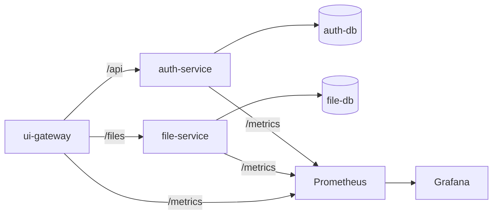

# DevSecOps Microservices Project

[](https://github.com/DevOps-Oct2025Team2/DevOps_Oct2025_Team2_Assignment-/actions/workflows/ci.yml)
[](https://github.com/DevOps-Oct2025Team2/DevOps_Oct2025_Team2_Assignment-/actions/workflows/sast.yml)
[](https://github.com/DevOps-Oct2025Team2/DevOps_Oct2025_Team2_Assignment-/releases)
[](https://www.docker.com/products/docker-desktop/)
[](https://www.python.org/downloads/)

A production-oriented DevSecOps template for Flask microservices with automated security validation, containerised workflows, and CI-driven quality controls.

## System Overview

- Flask microservices: auth-service, file-service, ui-gateway.
- Per-service PostgreSQL databases and migrations.
- Local orchestration with Docker Compose; CI/CD with GitHub Actions.
- Security gates: SAST, SCA, DAST, and Trivy image scans.
- Observability via Prometheus and Grafana; deployment to EC2 on main.

## Architecture

- auth-service
  - Issues JWTs, enforces roles, and manages users.
  - DB: auth-db (Postgres).
- file-service
  - File dashboard, upload, download, delete endpoints.
  - JWT validation, upload validation, ownership enforcement.
  - DB: file-db (Postgres).
- ui-gateway
  - Serves UI pages and proxies API calls to backend services.
- observability
  - Prometheus scrapes service metrics.
  - Grafana provides dashboards.



## Why Microservices (vs Monolith)

Trade-offs considered:

- Microservices add operational overhead (networking, monitoring, deployments) but improve ownership, scalability, and fault isolation.
- A monolith simplifies local development, but changes in one domain can increase regression risk for others.

Key design choices:

- Independent databases isolate data ownership, reduce cross-service coupling, and limit blast radius for schema changes.
- JWT-based authentication lets services verify identity locally without synchronous calls to auth-service, reducing runtime coupling.
- Docker Compose provides repeatable local environments and consistent service topology across developers.
- CI does not rely on Docker Compose for unit-test stages to keep builds fast and deterministic; Compose is used only for system acceptance and DAST workflows.

## Services and Ports

| Service | Purpose | Port |
| --- | --- | --- |
| auth-service | Authentication and user management APIs | 5000 |
| file-service | User file dashboard, upload, download, delete | 5002 |
| ui-gateway | Web UI + API proxy | 3000 |
| auth-db | Postgres for auth-service | 5433 (host) |
| file-db | Postgres for file-service | 5434 (host) |
| prometheus | Metrics scraping | 9090 |
| grafana | Metrics dashboards | 3001 |

## Security Model and Validation

Layered security controls executed automatically through CI/CD workflows and validated prior to integration:

- Identity: JWT-based authentication; HS256 in CI/TESTING, ES256 in production.
- Authorization: role-based access control enforced in backend services.
- Data isolation: per-service databases and per-user ownership enforcement in file-service.
- Supply chain: SCA flags dependencies with CVSS >= 7; Trivy reports High/Critical image findings.
- Runtime: DAST scans running services and reports High-severity findings.
- Secrets: injected via environment variables and GitHub Secrets; no secrets stored in the repository.

All workflows run automatically on push and pull request events. Results are visible before integration to ensure that security issues are identified early in the development lifecycle.

Branch Governance:

- The `main` branch requires pull requests before merging.
- At least one approval is required before integration.
- Conversation resolution is enforced prior to merge.
- Status checks must complete successfully before merge.
- Direct pushes to `main` are restricted.

Security workflows execute automatically on pull requests and push events, providing early validation before integration decisions are made.

## CI/CD Overview

| Workflow Name | Trigger | Purpose | Required Status Check | Deployment Impact |
| --- | --- | --- | --- | --- |
| ci.yml | push, pull_request | Unit tests, coverage, build, Trivy scan | Yes | None |
| system-tests.yml | push, pull_request, manual | End-to-end system acceptance tests | No | None |
| sast.yml | push, pull_request | CodeQL SAST (reports findings) | Yes (workflow completion) | None |
| sca.yml | push, pull_request | Dependency scanning (CVSS >= 7 flagged) | Yes (workflow completion) | None |
| dast.yml | push, pull_request (main, qa/qa, dev) | Runtime DAST scan | Yes (workflow completion) | None |
| release-please.yml | push to main | Create/update release PR and tags | No | Prepares release artifacts |
| auto-deploy.yml | push to main | Deploy to EC2 with health check and rollback | No | Production deployment |
| pr-title-lint.yml | pull_request | Enforce semantic PR title | Yes | None |

### Governance Model

This project adopts a validation-first DevSecOps approach. Security and quality workflows run automatically for every change. Protected branch rules ensure pull request review and successful workflow completion before integration.

While some workflows apply severity thresholds internally (e.g., CVSS scoring for dependency scans), enforcement is designed to balance security validation with development velocity within the scope of this academic MVP.

## Quickstart (Local)

1) Install external applications:

- Git: https://git-scm.com/downloads
- Docker Desktop (includes Docker Compose): https://www.docker.com/products/docker-desktop/
- Python 3.11: https://www.python.org/downloads/
- Node.js 20: https://nodejs.org/en/download

2) Clone and enter the repo:

```bash
git clone https://github.com/DevOps-Oct2025Team2/DevOps_Oct2025_Team2_Assignment-.git
cd DevOps_Oct2025_Team2_Assignment-
```

3) Create a local .env file in the repo root:

```env
EMAIL_RATE_LIMIT_SECONDS=60
ENABLE_RUNTIME_EMAILS=false
SMTP_USERNAME=
SMTP_PASSWORD=
EMAIL_FROM=
EMAIL_TEAM=
EMAIL_DEV=
EMAIL_QA=
APP_ENV=local
```

4) Start services:

```bash
docker-compose up -d --build
```

5) Run migrations:

```bash
docker-compose exec auth-service sh -c "FLASK_APP=app.py python -m flask db upgrade"
docker-compose exec file-service sh -c "FLASK_APP=app.py python -m flask db upgrade"
```

6) Validate health checks:

```bash
curl -f http://localhost:5000/health
curl -f http://localhost:5002/health
curl -f http://localhost:3000/health
```

Expected response for each is a JSON payload with status ok.

7) (Optional) Seed sample users:

```bash
docker-compose exec auth-service python sample_users.py
```

## Local vs CI Execution

- Local: Docker Compose + .env; stop services with `docker-compose down`.
- CI: unit tests run without Compose; Compose is used only for system tests and DAST.
- Secrets are injected via GitHub Actions in CI.

## Testing

### Unit Tests

```bash
cd auth-service
pip install -r requirements.txt
pytest -v

cd ../file-service
pip install -r requirements.txt
pytest -v
```

### System Tests (Docker)

```powershell
./scripts/test_all.ps1
```

This script runs unit tests, boots Docker Compose with CI overrides, and executes system tests.

## Observability

- Each service exposes Prometheus metrics at /metrics.
- Prometheus config: observability/prometheus.yml.
- Grafana runs at http://localhost:3001.

## CI/CD Setup Details

### Required GitHub Secrets

Set these in GitHub: Settings -> Secrets and variables -> Actions.

Email/notification secrets:

- SMTP_USERNAME
- SMTP_PASSWORD
- EMAIL_FROM
- EMAIL_TEAM
- EMAIL_DEV
- EMAIL_QA
- EMAIL_RATE_LIMIT_SECONDS
- ENABLE_RUNTIME_EMAILS
- APP_ENV

Security/keys:

- EC_PRIVATE_PEM (used by system tests to generate auth-service signing key)

Auto-deploy (production):

- EC2_HOST
- EC2_USER
- EC2_SSH_KEY

### Execute Workflows Manually

1) Go to the repository -> Actions tab.
2) Select the workflow.
3) Click Run workflow.

## Reuse as a Template

This repository is intended as a reusable DevSecOps microservices baseline. To adopt it for a new project:

- Replace service names and OpenAPI specs.
- Update Docker Compose service definitions.
- Keep security workflows and quality gates intact.
- Update deployment secrets and targets.
- Ensure branch protection rules require the same security checks.